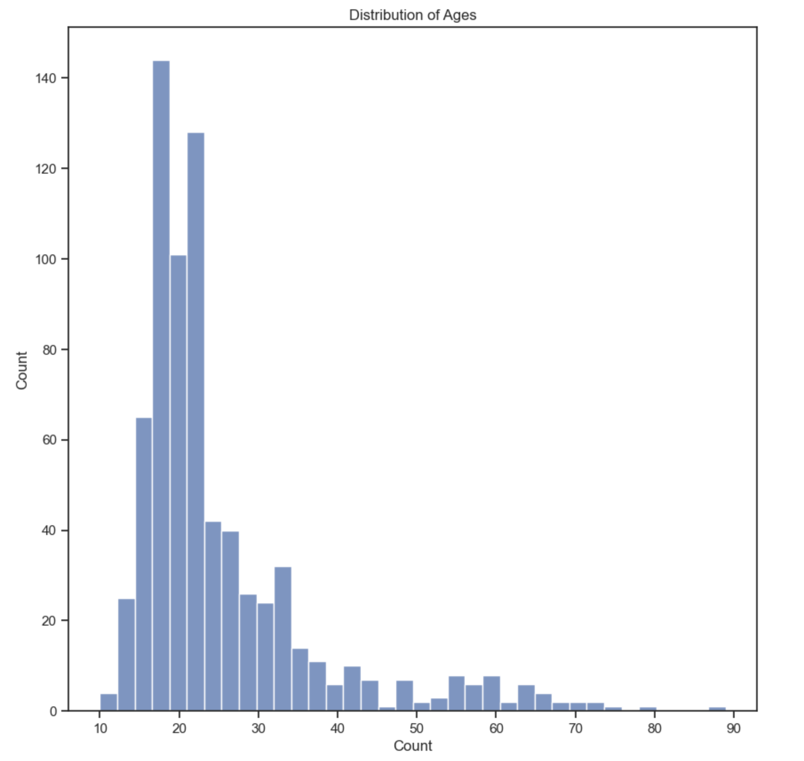
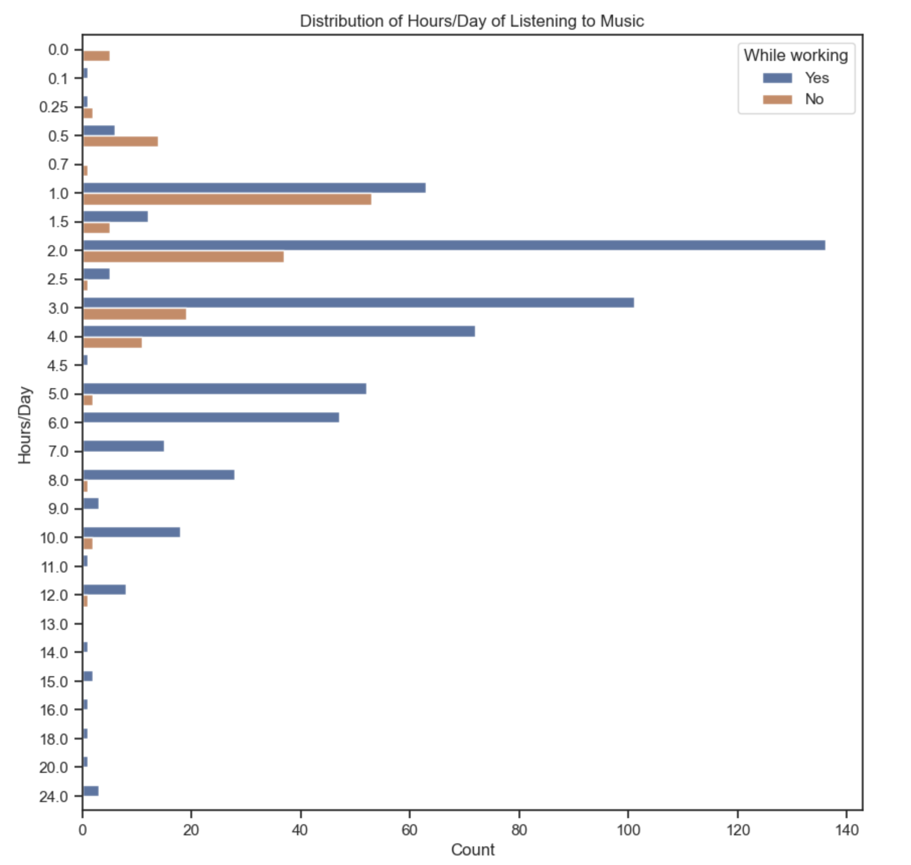
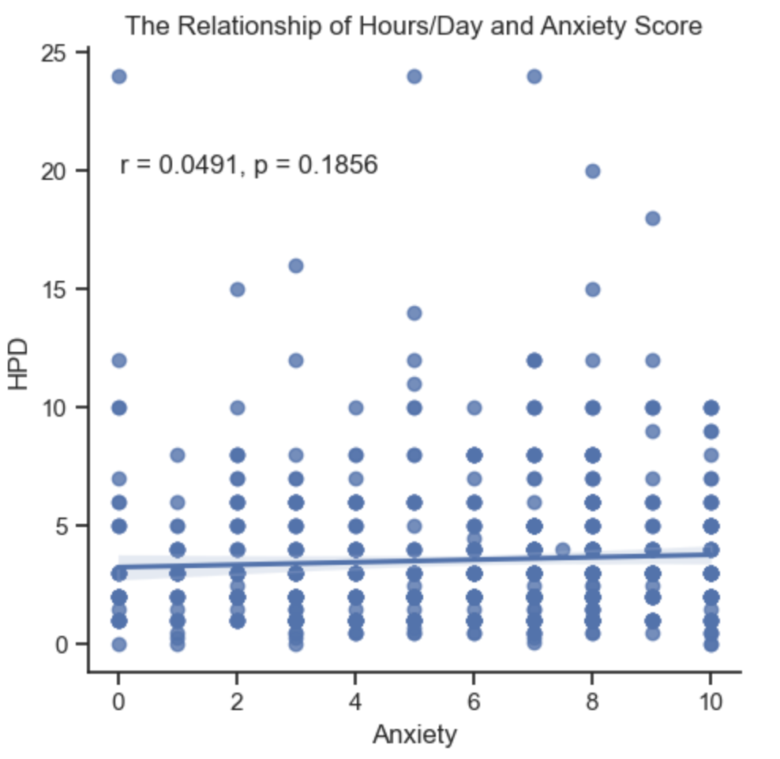
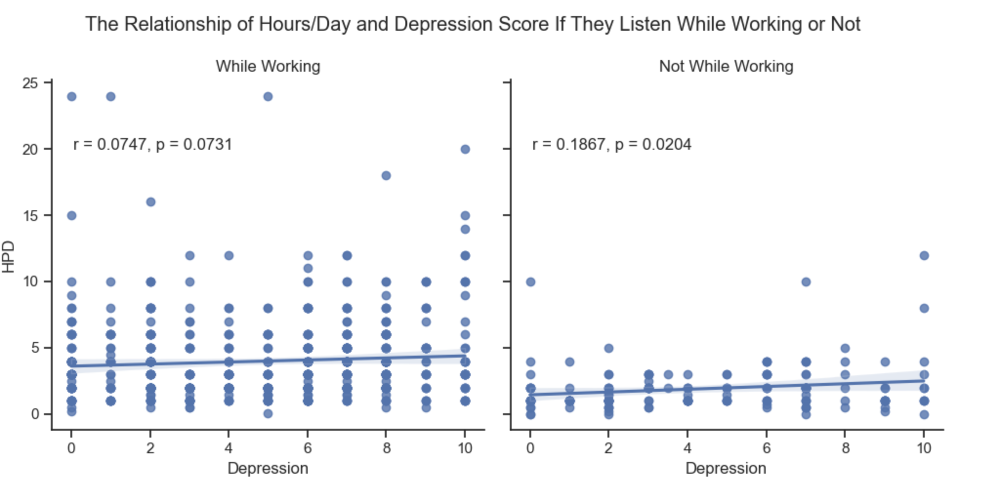

# Final Report For Analysis 1 - Patrick Ma

---------

### Introduction

My project research question was: Does listening to music for more hours per day result in lower reported levels of anxiety, depression, insomnia, and OCD, and does it depend on the whether an individual listens to music at work, is an instrumentalist (musician), or is a composer of music? I attempted to answer this question through a data set retrieved from [Kaggle](https://www.kaggle.com/datasets/catherinerasgaitis/mxmh-survey-results?resource=download). This dataset's observations were retrieved from survey and included self-reported observations of such information as the number of hours per day an individual would listen to music, various mental health scores out of 10 (10 being the highest; namely depression, insomnia, anxiety and OCD), whether they were composers or not, musicians or not, and whether they listened to music while working or not. Although there was more information included in the dataset, these were all the data I needed to explore my research problem. I was interested in this research question because I, myself, feel that music has always helped me calm down in times of stress or worsening mental health. I wanted to see if more hours of music did indeed help lower self-percieved levels of such mental ailments.

### Exploratory Data Analysis
Through exploring the data provided by this dataset, I was able to find out a lot about the relationships of these variables. Here are some highlights from my findings. The highest number of observations came from individuals whose age fell in the range of [10,20].

I also found that the majority of observations came from individuals who listened to music while working.

### My Findings

To reiterate, my research question was: Does listening to music for more hours per day result in lower reported levels of anxiety, depression, insomnia, and OCD, and does it depend on the whether an individual listens to music at work, is an instrumentalist (musician), or is a composer of music? To help answer this question, I created linear regression plots and checked if the p-values from t-tests of each of the plots were sufficient to assume there was a relationship. In order to classify this, I checked if they were lower than my significance level (alpha) of 0.05.

In all of my plots, I found that regardless of which group individuals landed in (ie. listen while working/not, musician/not, composer/not), the number of hours of music listening per day did not seem to have a correlational relationship with anxiety.

As can be seen above, the p-value for the plot including all observations was not sufficient in that it was not below 0.05. This meant that there was likely no correlational relationship present here to model. This was, again, the case for all subsets of these observations.

I also found that, all other mental health scores seemed to have a correlational relationship with the number of hours one listened to music per day. To illustrate, here is a plot of hours per day vs depression scores:

As can be seen above, the p-value for the plot including all observations was sufficient for this plot and a similar case was true for the other mental ailment scores as well. In all these cases, there seemed to be a positive correlational relationship signifying that when the number of hours per day one listened to music increased, there was also an increase of these scores.

Next, I moved onto building these plots for the subsets of these observations. First for whether individuals listened to music while working or not. Then for whether individuals were musicians or not. And finally, for whether individuals were composers or not. An example of these plots can be found below.

Here is a summary of my findings in point form:

- For While Working or not:
    - Depression score when working does not seem to have a relationship with hours per day, but individuals who don't listen to music while working do exhibit a positive correlational linear relationship with HPD
    - Insomnia score does increase with HPD for individuals who listen to music while working but not for those who don't
    - Similarly, OCD scores also increase with HPD for individuals who listen to music while working but not for those who don't

- For Musicians/Instrumentalists or not:
    - Depression score seems to have a relationship with HPD only for individuals who are musicians
    - Insomnia score seems to have a relationship with HPD regardless of whether an individual is a musician or not
    - OCD score seems to have a relationship with HPD only for individuals who are not musicians

- For Composers or not:
    - Depression score seems to have a relationship with HPD only if the individual is not a composer
    - Insomnia score seems to have a relationship with HPD only if the individual is not a composer
    - OCD score seems to have a relationship with HPD only if the individual is not a composer

### Conclusion
From this project, I found out a lot about the relationship between hours of daily music listening and these mental ailment scores. Namely that when there existed a relationship, it was a positively sloping one. This indicated, that listening to more music seemed to increase ratings of these scores. I realized after conducting my exploration, that there was no indication that hours of daily music listening was the dependent variable however. It could also be equally plausible that individuals listened to more music because they were dealing with these mental ailments. I also found an interesting conclusion in that if one was a composer, there seemed to be no relationship at all. Perhaps this is because composers interpret music differently than others and thus have a different relationship with music listening in regards to their mental health.