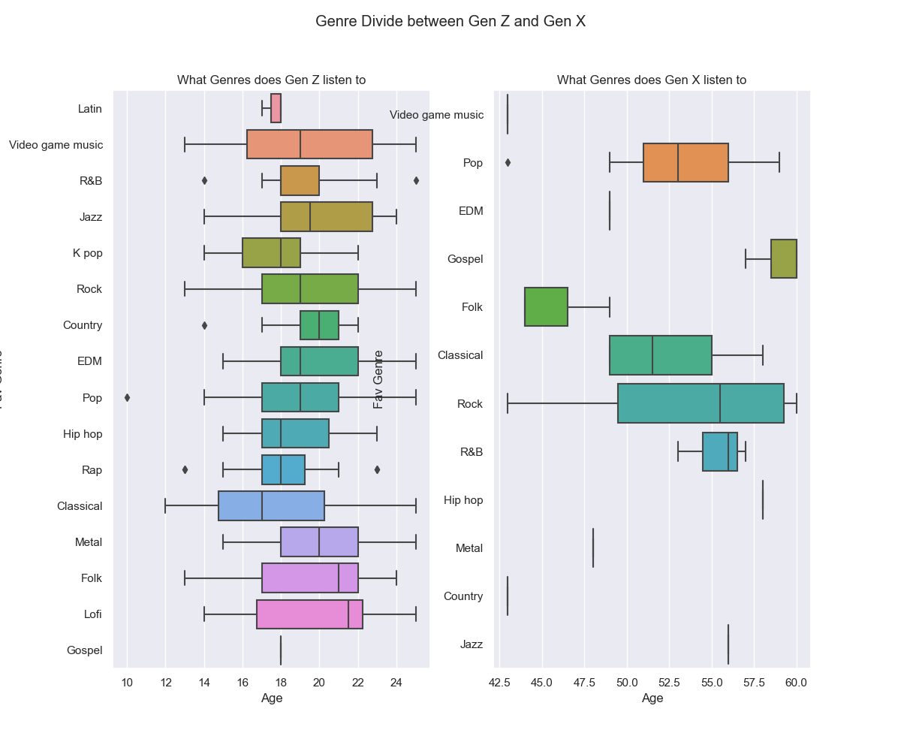
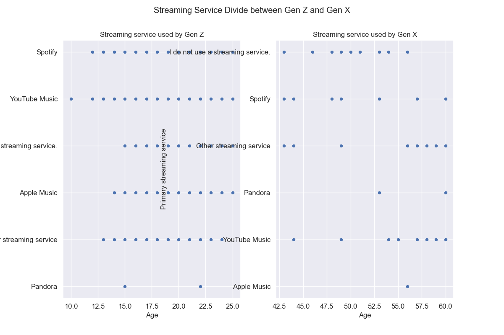

# Introduction 
My reasearch topic was "How different are Gen Z's music habits from their Parents?". I liked this topic based on my own interests, I am very obsessed with listening to music I do it for hours daily and so are my parents. Seeing the difference between my and my parents's music taste i decided to pick this topic. On exploring through it I found surprising answers.

# Research 
The data was obtained from Kaggle and the data was self reported. After cleaning up the raw data I presented it.

I wanted to compare the genres, how long they listen, the overall BPM of the music and their respective streaming services.
on doing that and analysing further these were the results.

#### For Genres 

On analysing most of Gen Z listens to almost all genres and is very diverse but the most Frequent out of them all is Rock. Most of Gen X listens to Rock, Pop and R&B for the most part and its not very diverse. But the genre that is most frequent for them is Rock as well

#### For Hours Per Day

Gen Z on an average listens to about 3.7 hours of music in a day. Gen X on an average listens to 3 hours of music in a day.

#### For if they were exploratory in their taste

Gen Z is very exploratory in nature as an overwhelming amount of them are exploratory in their music taste. Even though Gen X leans towards not being exploratory as compared to Gen Z

#### For thier BPM 

Gen Z usually listens to a lot of upbeat music ranging around 120 BPM. Gen X on the other hand listens to music that is very upbeat around 150 BPM

#### For their Streaming Services 

The most popular streaming service amongst gen Z is "Spotify". The most popular streaming service amongst gen X is "I do not use a streaming service"

# Conclusion

After analysing the data I have concluded that:-

- Gen Z listens to a lot more genres that Gen X does. Since Gen X was born in a time where radio was the only place they could listen to music for free, their music taste was dependant on the mainstream view. Hence Gen X mainly listens to Rock and not a lot of other genres. Most of Gen Z was born in a time where websites like Napster were there so everyone was used to listening to musi conline for free. Therefore Gen Z has a very diverse music taste.
- Gen Z and Gen X listen to around 3 hours a day even though both have different lives and free time, both Gen Z and Gen X listen to about the same hours per day.
- Spotify is the most popular streaming service for Gen Z wheras using No Streaming Service was the most popular option. Gen X is a pretty old generation and they still probably consume their music from the radio or other sources like youtube unlike the tech savvy Gen Z who overwhelingly uses Gen Z.
- Gen Z is also overwhelimgly more explorartory than Gen X.Since Gen X was born in a time where radio was the only place they could listen to music for free, their music taste was dependant on the mainstream view. Hence Gen X mainly listens to Rock and not a lot of other genres. Most of Gen Z was born in a time where websites like Napster were there so everyone was used to listening to musi conline for free. Therefore Gen Z has a very diverse music taste.
- Gen X on an avergae listen to higher bpm of music than Gen Z. This was very surprising as music nowadays seems pretty fast. But due to Gen Z's diverse music taste the average BPM ends up lower than the Rock music dominant Gen X.
